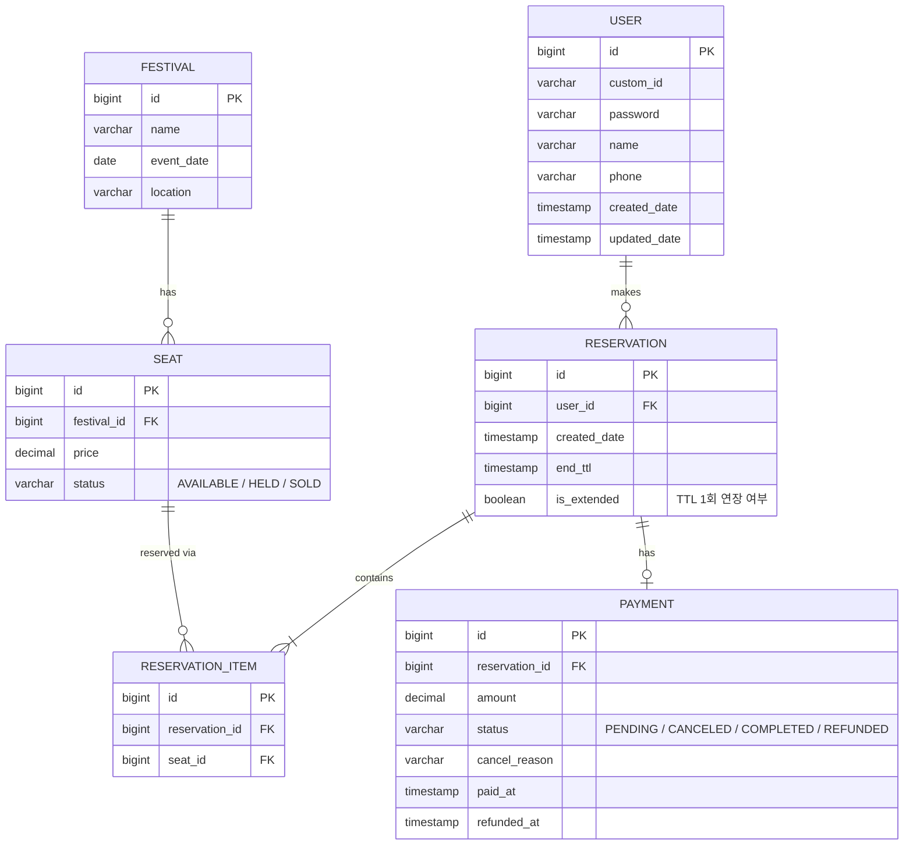

# Festix ERD & 설계 오류 노트

> Notion에 붙여넣을 때: 아래 ```mermaid 코드 블록을 복사해서 Notion 코드 블록에 붙여넣고, 코드 블록 언어를 **Mermaid**로 지정하면 다이어그램이 바로 렌더링됩니다.

---

## 1. ERD



## 2. 테이블 상세

### festival
| 컬럼 | 타입 | 설명 |
|---|---|---|
| id | BIGSERIAL (PK) | |
| name | VARCHAR | 페스티벌 이름 (가상) |
| event_date | DATE | 행사 날짜 |
| location | VARCHAR | 장소 |

### seat
| 컬럼 | 타입 | 설명 |
|---|---|---|
| id | BIGSERIAL (PK) | |
| festival_id | BIGINT (FK → festival.id) | |
| price | DECIMAL | 좌석 가격 |
| status | VARCHAR (ENUM) | AVAILABLE / HELD / SOLD |

### reservation (예약 시도, 묶음 단위)
| 컬럼 | 타입 | 설명 |
|---|---|---|
| id | BIGSERIAL (PK) | |
| user_id | BIGINT (FK → user.id) | 예약을 시도한 유저 |
| created_date | TIMESTAMP | 예약 시도 시각 |
| end_ttl | TIMESTAMP | 선점 만료 시각 (created_date + N분, INSERT 시점에 값으로 저장) |
| is_extended | BOOLEAN (default false) | 결제 시도 중 TTL 1회 연장 여부 (중복 연장 방지용) |

### reservation_item (개별 좌석 단위, reservation의 자식)
| 컬럼 | 타입 | 설명 |
|---|---|---|
| id | BIGSERIAL (PK) | |
| reservation_id | BIGINT (FK → reservation.id) | |
| seat_id | BIGINT (FK → seat.id) | |

### payment
| 컬럼 | 타입 | 설명 |
|---|---|---|
| id | BIGSERIAL (PK) | |
| reservation_id | BIGINT (FK → reservation.id) | 좌석 묶음 전체에 대한 결제 1건 |
| amount | DECIMAL | 결제 확정 시점 금액 (박제 저장, 이후 가격 변동과 무관) |
| status | VARCHAR (ENUM) | PENDING / CANCELED / COMPLETED / REFUNDED |
| cancel_reason | VARCHAR (nullable) | CANCELED일 때만 값 존재 |
| paid_at | TIMESTAMP | 결제 확정 시각 |
| refunded_at | TIMESTAMP (nullable) | 환불 확정 시각, REFUNDED일 때만 값 존재 |

### user
| 컬럼 | 타입 | 설명 |
|---|---|---|
| id | BIGSERIAL (PK) | |
| custom_id | VARCHAR (UNIQUE) | 로그인 ID |
| password | VARCHAR | BCrypt 암호화 |
| name | VARCHAR | |
| phone | VARCHAR | |
| created_date | TIMESTAMP | |
| updated_date | TIMESTAMP | |

**만료 처리 시 핵심 쿼리 (레이스 컨디션 방지):**
```sql
UPDATE seat SET status = 'AVAILABLE' WHERE id = ? AND status = 'HELD';
```
→ 결제가 먼저 완료돼 `status`가 이미 `SOLD`로 바뀌어 있으면 영향받은 row 수가 0이 되어 아무 일도 일어나지 않음. 별도 우선순위 로직 없이 조건부 UPDATE만으로 안전하게 처리됨.

---

## 3. 설계 과정에서 발견하고 수정한 오류들

| # | 오류 | 왜 문제였는가 | 어떻게 해결했는가 |
|---|---|---|---|
| 1 | "예약 관계가 존재한다"고 말해놓고 실제로는 `seat`에 `user_id`를 직접 넣으려 함 | 관계를 표현하겠다는 말과 실제 설계가 모순됨 — 관계 자체가 별도 엔티티 없이 속성으로 흡수됨 | `reservation` 테이블을 별도로 분리 |
| 2 | 여러 좌석을 한 번에 예약하는 "묶음" 개념이 없어서 `created_date`로 묶으려 시도 | 서버가 좌석을 하나씩 처리하면 `created_date`가 미세하게 달라질 수 있고, 같은 유저의 다른 예약 시도와도 혼동될 수 있음 | 묶음 자체를 나타내는 상위 개념(`reservation`)을 도입 |
| 3 | `reservation`과 `payment`가 각각 `user_id`, `seat_id`를 중복 보유 | 두 테이블 중 어디가 "진짜 현재 상태"의 소스인지 불분명해짐 | `payment`는 `reservation_id`만 참조하도록 단순화 |
| 4 | TTL을 `payment`(결제) 테이블에 배치 | TTL은 좌석을 **선택하는 순간** 시작되는데, 결제는 그보다 나중 단계라 타이밍이 맞지 않음 | TTL(`end_ttl`)을 `reservation`(예약 시도) 테이블로 이동 |
| 5 | `booking`/`reservation` 두 용어가 헷갈려서 "결제 완료 여부"로 구분하려 함 | 실제 차이는 "단위(레벨)"이지 "결제 여부"가 아니었음 — 잘못된 기준 | `order`/`order_item` 패턴을 참고해 `reservation`(부모)/`reservation_item`(자식)으로 통일 |
| 6 | `reservation_item`에 `reservation_id`를 여러 개 담으려 시도 | 1NF(원자성) 위반 — 배열형 컬럼 | 각 row가 `reservation_id` 하나씩만 참조하도록 정규화 |
| 7 | `reservation_item`에서 부모를 가리키는 `reservation_id` 컬럼 자체를 누락 | FK가 없으면 부모-자식 관계가 DB상에 존재하지 않는 것과 같음 | `reservation_item`에 `reservation_id` FK 추가 |
| 8 | `user_id`를 `reservation_item`(자식, 좌석 단위)에 배치 | 한 번의 예약 시도(좌석 3개)에 대해 동일한 `user_id` 값이 3번 중복 저장됨 | `user_id`를 부모 `reservation`으로 이동 |
| 9 | `reservation_item`에 자체 `created_date` 컬럼 추가 | 부모 `reservation`의 시각과 항상 동일한 값이 반복 저장될 뿐, 별도 의미가 없음 | `reservation_item`에서 `created_date` 제거 |
| 10 | `payment.amount`를 TTL과 같은 논리로 "조회 시점 계산(조인 합산)"이 맞다고 판단 | TTL은 "진행 중인 상태"라 계산이 맞지만, 결제 금액은 "이미 끝난 거래"라 반대 논리가 적용돼야 함 — 원칙을 잘못 일반화 | `amount`는 결제 확정 시점 값으로 박제 |
| 11 | 좌석이 "진짜 예약 가능한지"를 판단하는 소스가 `seat.status`(enum)와 `reservation.end_ttl`(시간 계산)로 이원화되어 있는데 둘의 정합성을 처음엔 고려 안 함 | 두 소스가 항상 일치한다는 보장이 없음 | `HELD` 상태를 도입해 "선점 중" 구간을 명시적으로 표현 |
| 12 | TTL 만료 시 좌석 상태를 되돌리는 자동화 로직에서, 결제 완료 여부를 확인하지 않고 무조건 되돌리려 함 | 결제가 막 완료된 좌석을 자동화 로직이 다시 `AVAILABLE`로 되돌려버리는 레이스 컨디션 발생 가능 | `WHERE status = 'HELD'` 조건부 UPDATE로 안전하게 처리 (결제 완료 시 이미 `SOLD`라 조건에 안 걸림) |
| 13 | Kafka/RabbitMQ를 "유료 전용"으로 오해 | 오픈소스 기술 자체와 관리형 클라우드 서비스(유료)를 혼동 | 직접 Docker로 호스팅하면 무료라는 점 확인 |
| 14 | `payment.status`를 PENDING/COMPLETED 2단계로만 설계 | 결제 실패나 중도 이탈 케이스를 표현할 방법이 없음 | PENDING/CANCELED/COMPLETED 3단계 + 취소 사유 컬럼 추가 |

> 참고: TTL(`end_ttl`)은 처음부터 "INSERT 시점에 값으로 저장"으로 정확하게 답했고, 재확인 질문(정책 변경 시 소급 여부)에도 올바르게 답했음 — 이 항목은 오류가 아니라 검증 과정이었음.

---

## 4-6. 환불 정책 (결제 완료 후 취소)

- `payment.status`에 `REFUNDED` 추가, `CANCELED`(결제 미완료 상태에서의 취소)와 명확히 구분
    - `CANCELED` = TTL 만료, PG사 타임아웃 등 **결제 자체가 안 끝난 채** 종료
    - `REFUNDED` = **결제 완료 후** 사용자 변심 등으로 환불 처리
- 부분 환불(3자리 중 2자리만 환불) 미지원 — `reservation` 단위 **all-or-nothing 전량 환불만 지원**
    - 좌석 선점 단계의 all-or-nothing 원칙(하나라도 실패 시 전체 롤백)을 예약 생애주기 전체에 일관되게 적용한 것
    - 부분 환불을 지원하려면 `reservation_item`에 개별 취소 여부, `payment`에 누적 환불액 컬럼이 추가로 필요 — 이 프로젝트의 핵심 증명 포인트(동시성 제어)와 무관한 복잡도 증가로 판단해 스코프에서 제외
    - 실무에서는 PG사의 부분 환불 API + item 단위 취소 추적으로 지원 가능하나, 항공권 등 실제 서비스에서도 상품 정책에 따라 그룹 전체 취소만 허용하는 경우가 있음
- 환불 처리 시 좌석 복구 쿼리 (기존 만료 처리와 대칭되는 패턴):
  ```sql
  UPDATE seat SET status = 'AVAILABLE' WHERE id = ? AND status = 'SOLD';
  ```
  → 결제 완료 후 취소이므로 조건이 `HELD`가 아니라 `SOLD`. 동시에 `payment.status`를 `COMPLETED → REFUNDED`, `refunded_at`도 함께 갱신.

## 4. 결제 이탈 / TTL 연장 / pub-sub 유실 복구 설계

### 4-1. payment row 생성 시점
- 좌석 선점(HELD)만 하고 결제 페이지에 진입 안 한 경우 → `payment` row **생성 안 함**
- "결제하기" 버튼을 눌러 PG사에 요청을 보낸 순간 → `payment` row `PENDING`으로 생성

### 4-2. 결제 대기 중 TTL 연장
- PG사 응답 대기 중 `reservation.end_ttl`이 얼마 안 남을 수 있음 → 결제 버튼 클릭 시점에 TTL을 **1회 한정, 5분으로 완전 리셋**
- 무제한 연장 방지를 위해 `reservation.is_extended` 컬럼으로 연장 여부 추적
- 갱신 순서: **Redis 먼저 → Postgres 나중** (Redis가 "좌석이 실제로 풀리는" 기준이므로, Redis 갱신 실패 시 Postgres도 갱신하지 않아야 함. 반대 순서면 화면엔 "5분 남음"으로 보이는데 실제로는 곧 풀려버리는 훨씬 위험한 불일치가 생김)
- (제안) 잔여 시간 표시는 Postgres `end_ttl`이 아니라 Redis의 실제 TTL 값을 조회해서 보여주는 방향 — Postgres `end_ttl`은 표시용이 아니라 정합성/이력 기록용으로만 사용

### 4-3. PENDING 정리
- `PENDING` 상태에서 결제가 끝내 완료되지 않고 좌석이 만료되는 경우, 좌석 복구(`HELD`→`AVAILABLE`)와 **함께** `payment.status`도 `CANCELED`로 갱신
- DELETE가 아니라 상태값으로 논리적 갱신 (기록 보존 목적 — 이탈률 등 지표 활용 가능)
- `cancel_reason`은 트리거 종류에 따라 문구를 구분해서 기록 (아래 4-5 참고)

### 4-4. Redis pub/sub 유실 복구 (안전망 배치)
- 목적: pub/sub은 실시간 처리를 담당하고, 배치는 **놓친 것만 가끔 건져주는 안전망** — 촘촘한 폴링 불필요, 1분 주기 정도로 충분
- 쿼리 방향:
  ```sql
  SELECT * FROM reservation r
  JOIN seat s ON s.id = r.seat_id  -- 실제로는 reservation_item 경유
  WHERE s.status = 'HELD' AND r.end_ttl < NOW();
  ```
- 좌석 복구는 기존에 만든 조건부 UPDATE(`WHERE status='HELD'`)를 **그대로 재사용** — 별도 안전장치 불필요 (이미 SOLD인 좌석은 조건에 안 걸려서 자동으로 보호됨)
- 이 배치에서 좌석이 잡히면 해당 `payment`도 `PENDING`이었다면 `CANCELED`로 함께 갱신 (4-3과 동일 원칙)

### 4-5. 모니터링 포인트
- 정상 상황이라면 안전망 배치의 조회 결과는 **0건이어야 정상** — 꾸준히 몇 건씩 잡힌다면 우연이 아니라 pub/sub 유실이 구조적으로 발생하고 있다는 신호
- `cancel_reason`을 트리거별로 구분해서 기록: 예) `"EXPIRED_BY_EVENT"`(pub/sub 정상 처리) vs `"EXPIRED_BY_BATCH_RECOVERY"`(안전망이 뒤늦게 잡음)
- Prometheus에 안전망 배치의 "복구 건수" 메트릭 추가 → 유실률 관찰 대상으로 남겨둠